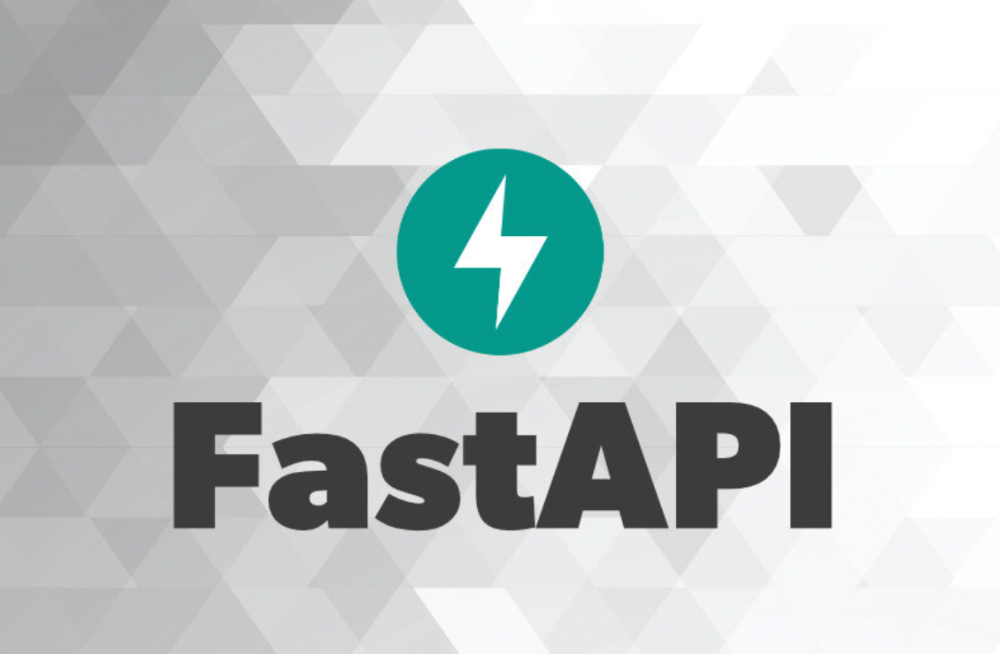

<table>
<tr>
<td width="35%" align="center">

</td>

<td width="65%">

## ⚡ Python FastAPI framework

**FastAPI** framework yordamida yaratilgan amaliy backend loyihalar to‘plami. Ushbu repository orqali **Python** va **FastAPI** asosida turli xil web API'lar ishlab chiqiladi, FastAPI'ning asosiy imkoniyatlari o‘rganiladi va real loyihalar orqali backend development ko‘nikmalari rivojlantiriladi.

Har bir loyiha alohida papkada saqlanadi va o‘zining API endpoint'lari, database tuzilmasi, authentication va FastAPI architecture'iga ega.

**🐍 Python** | **⚡ FastAPI** | **🗄️ SQLite** | **🐘 PostgreSQL**

</td>
</tr>
</table>

---

# ⚡ Python FastAPI framework

| № | Project name | GitHub Repositories | Date |
|:-:|:--------:|:--------:|:----:|
| 1 | to-do-project-v2 | https://github.com/javlonbeksaidov-developer/to-do-project-v2 | 08.08.2026 |
| 2 | post-blog-project-v1| https://github.com/javlonbeksaidov-developer/post-blog-project-v1 | 11.08.2026 |
| 3 | income-expenditure | https://github.com/javlonbeksaidov-developer/income-expenditure | 16.08.2026 |
| 4 | pharmacy-sales-project| https://github.com/javlonbeksaidov-developer/pharmacy-sales-project | 18.08.2026 |
| 5 | library-fastapi-project | https://github.com/javlonbeksaidov-developer/library-fastapi-project | 26.08.2026 |
| 6 | hotel-booking-fastapi-project | https://github.com/javlonbeksaidov-developer/hotel-booking-fastapi-project | 28.08.2026 |
| 7 | to-do-project-v3 | https://github.com/javlonbeksaidov-developer/to-do-project-v3 | 01.09.2026 |
| 8 | post-blog-project-v2 | https://github.com/javlonbeksaidov-developer/post-blog-project-v2 | 02.09.2026 |
| 9 |-|-|-|
